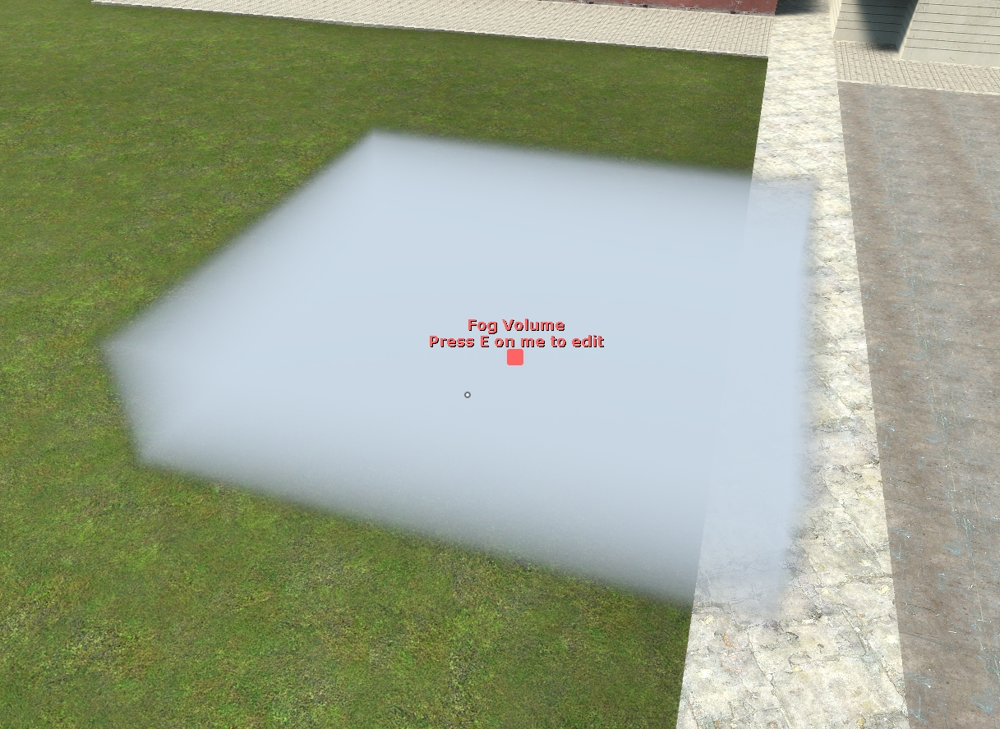

# Fog 2 Documentation

Documentation for the fog 2 addon for GMod.

## Editing the fog editors
All the editor entities have been designed not to collide with anything, but still be able to be grabbed by the Physgun, edited with the Toolgun and selected through the C menu.

Doing this for the C menu required a workaround, so instead of right-clicking the entity, you must press E while aiming at it with your cursor.
Additionally, some helper text will pop-up when you open the C menu to help you find the entity if it is obscured by the fog, as such:



The small red square is where you should aim, as it is placed at the center of the editor.

## Lua Functions

* <span class=Func>render.DrawFogVolumeCheap(pos: Vector, aabb: Vector, density: Float, fogstart: Float, fogend: Float, color: VectorColor, edgefade: Float)</span> - **Draw a cheap volume that only obscures what it intersects. (No real volumetrics)**

* <span class=Func>render.DrawFogVolume(pos: Vector, aabb: Vector, density: Float, fogstart: Float, fogend: Float, color: VectorColor, edgefade)</span> - **Draw a real volumetric fog volume.**

* <span class=Func>render.DrawFogVolume2DNoise(pos: Vector, aabb: Vector, density: Float, fogstart: Float, fogend: Float, color: VectorColor, edgefade: Float, noisesize: Float, noisemininfluence: Float, noisemaxinfluence: Float, scrollx: Float, scrolly: Float)</span> - **Draw a fog volume that is modulated by a scrolling 2D noise texture.**

* <span class=Func>render.DrawFogVolume3DNoise(pos: Vector, aabb: Vector, density: Float, fogstar: Floatt, fogend: Float, color: VectorColor, edgefade: Float, noisesize: Float, noisemininfluence: Float, noisemaxinfluence: Float, scrollx: Float, scrolly: Float, scrollz: Float)</span> - **Draw a fog volume that is modulated by a scrolling 3D noise texture.**

* <span class=Func>render.DrawRadialFog(density: Float, fogstart: Float, fogend: Float, fogcolor: VectorColor, skyblend: Float)</span> - **Draw radial fog around the camera.**

* <span class=Func>render.DrawRadialFogFromPoint(pointVec: Vector, density: Float, fogstart: Float, fogend: Float, fogcolor: VectorColor, skyblend: Float)</span> - **Draw radial fog from a point in the world.**

## Example

All the fog shaders are drawn with alphablended screen quads.

In normal circumstances you would draw these in the `RenderScreenspaceEffects` hook.

This will draw a 500x500x250 fog volume at the center of the map and remove it after 5 seconds.
`vector_origin` and `color_white` are static globals provided by Garry's Mod.

```lua
local size = Vector( 500, 500, 250 )

hook.Add("RenderScreenspaceEffects", "Fog_Test", function()
    render.DrawFogVolume(vector_origin, size, 1, 0, 100, color_white, 30)
end)

timer.Simple(5, function()
    hook.Remove("RenderScreenspaceEffects", "Fog_Test")
end)
```